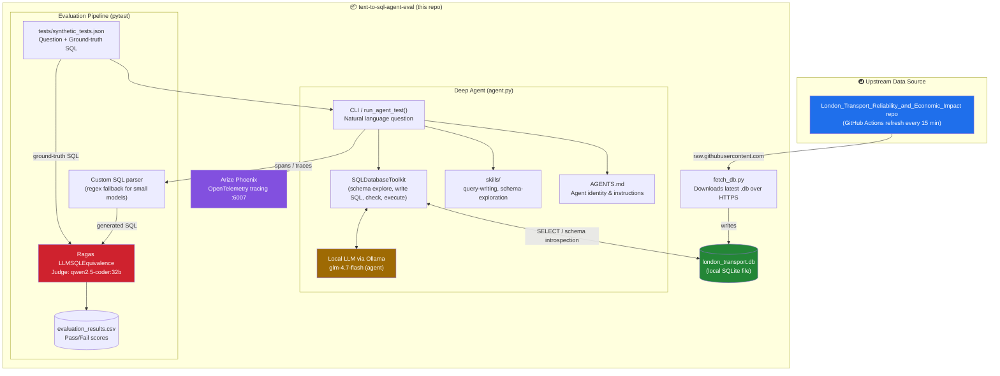
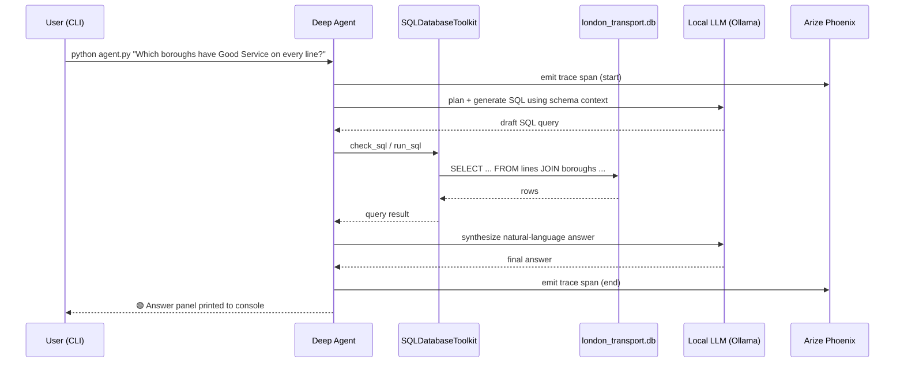
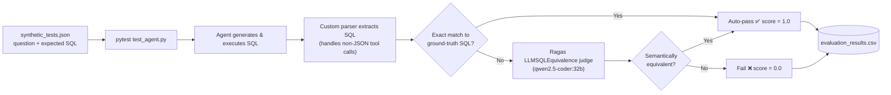

# 🤖 Local Text-to-SQL Agent with Ragas Evaluation

An automated, locally-hosted AI agent that translates natural language questions into executable SQL queries, runs them against a live database, and evaluates its own performance using a fully local **Ragas + Pytest** evaluation pipeline.

This project runs **100% offline**: all inference happens through local LLMs served by **Ollama**, so no data ever leaves your machine, while **Arize Phoenix** provides enterprise-grade tracing/observability of every agent step.

The agent currently queries a **London Transport reliability & economic-impact database**, which is pulled automatically from a companion data-engineering repo (see [Where the data comes from](#-where-the-data-comes-from) below).

---

## 📐 Architecture — Data flows

The diagram below shows the full path: from the upstream London Transport data repo, through the local SQLite database, into the LangChain **Deep Agent**, and out through observability and evaluation.



### How a single question flows through the system



### Evaluation pipeline (pytest + Ragas)



---

## 🚇 Where the data comes from

The `london_transport.db` SQLite file used by the agent is **not stored statically** in this repo — it's fetched fresh from a companion data pipeline repo:

- **Source repo:** [`London_Transport_Reliability_and_Economic_Impact`](https://github.com/Aashleshaj/London_Transport_Reliability_and_Economic_Impact)
- **Mechanism:** that repo runs a scheduled GitHub Action that rebuilds and commits `data/london_transport.db` roughly every 15 minutes.
- **How this repo consumes it:** [`fetch_db.py`](./fetch_db.py) downloads the latest copy over plain HTTPS (no auth needed, since the source repo is public) and saves it locally as `london_transport.db` before the agent runs.
- **What it contains (based on the sample questions the agent supports):** London borough/line service status, disruption events and their causes/severity, and estimated economic impact (GVA at risk) from delays — the kind of question the agent is built to answer includes:
  - *"Which boroughs currently have Good Service on every line?"*
  - *"What's the estimated GVA at risk across all of London right now?"*
  - *"Which disruption cause has the highest average severity?"*

Run `python fetch_db.py` any time you want to re-sync against the latest data before querying.

---

## ✨ Features

- **Agentic SQL Generation:** Uses LangChain **Deep Agents** to explore the database schema, write SQL, check syntax, and execute queries autonomously.
- **Fully Local Stack:** Powered entirely by local models (e.g., Qwen, DeepSeek, GLM) via Ollama — no OpenAI/Anthropic API keys required for inference.
- **Live, Auto-Refreshing Data:** `fetch_db.py` pulls the latest London Transport database from an upstream pipeline that updates every 15 minutes.
- - **Automated Testcase Generation:** Generate testcases by evaluation database, skill.md and generated SQL against a ground-truth dataset using Langchain PromptTemplate. `python generate_test_dataset.py`.
- **Automated AI Grading:** Evaluates generated SQL against a ground-truth dataset using Ragas (`LLMSQLEquivalence`) — a query "passes" even if the syntax differs, as long as it's logically equivalent.
- **Resilient Parsing:** Custom regex fallbacks extract SQL reliably from smaller local models (4B–8B) that struggle with strict JSON tool-calling.
- **Live Observability:** Integrated with **Arize Phoenix** for real-time tracing of the agent's reasoning, tool calls, and database interactions.
- **Automated Reporting:** Every evaluation run appends Pass/Fail scores to a clean `evaluation_results.csv`.

---

## 🛠️ Prerequisites

1. **Python 3.10+**
2. **[Ollama](https://ollama.com/)** running locally (default `http://localhost:11434`, or point at a custom network host — see `agent.py`).
3. **Hardware:** at least 8GB RAM (16GB+ recommended for 7B–30B parameter models).

### Recommended local models

```bash
# Agent model (strong coding logic)
ollama run qwen3-coder:30b-a3b-q4_K_M
# OR
ollama run deepseek-coder-v2:lite

# Ragas evaluator / judge (higher parameter count for accurate grading)
ollama run qwen2.5-coder:32b
```

---

## 🚀 Setup

1. **Clone the repository**

   ```bash
   git clone https://github.com/Aashleshaj/text-to-sql-agent-eval.git
   cd text-to-sql-agent-eval
   ```

2. **Create a virtual environment**

   ```bash
   python -m venv venv
   source venv/bin/activate  # On Windows: venv\Scripts\activate
   ```

3. **Install dependencies** (via `pyproject.toml` / `uv.lock`, or `pip install -e .`)

4. **Get the database.** Either:
   - Fetch the live London Transport database: `python fetch_db.py`.

5. **Copy `.env.example` to `.env`** and set any tracing/LangSmith variables you need.

6. **Generate testcase** for evaluation.

---

## 🚀 Usage

### 1. Interactive CLI mode

Ask the agent a natural-language question directly; it will explore the schema and return an answer.

```bash
python agent.py "Which boroughs currently have Good Service on every line?"
python agent.py "What's the estimated GVA at risk across all of London right now?"
python agent.py "Which disruption cause has the highest average severity?"
```

### 2. Automated evaluation pipeline (Pytest + Ragas)

Run the automated test suite to grade the agent against `tests/synthetic_tests.json`.

```bash
pytest tests/test_agent.py -v -s --cache-clear
```

**What happens during evaluation:**
1. Pytest feeds a question to the agent.
2. The agent generates and executes SQL against the database.
3. A custom parser safely extracts the SQL from the agent's response.
4. Ragas compares the agent's SQL against the ground-truth SQL.
5. Exact matches auto-pass; otherwise the Ragas LLM judge decides semantic equivalence.
6. The score (0.0 or 1.0) is appended to `evaluation_results.csv`.

---

## 📁 Project structure

```
├── agent.py                  # Core LangChain Deep Agent logic & Phoenix tracing setup
├── fetch_db.py                # Pulls the latest london_transport.db from the upstream data repo
├── AGENTS.md                  # Agent identity & general instructions (always loaded)
├── skills/                    # Specialized workflows (query-writing, schema-exploration)
├── tests/
│   ├── test_agent.py          # Pytest framework, Ragas evaluation, fallback parsing
│   └── synthetic_tests.json   # Ground-truth dataset (questions, expected SQL, answers)
├── data/
│   └── flowchart.png          # Original architecture diagram
├── agent.d2                   # D2 source for the architecture diagram
├── chinook.db                 # Sample SQLite database (offline testing)
├── london_transport.db        # Live London Transport database (fetched, not hand-edited)
├── evaluation_results.csv     # Auto-generated report of test scores
├── pyproject.toml / uv.lock   # Project configuration & locked dependencies
├── .env.example                # Environment variable template
└── README.md
```

---

## 🔍 Observability (Arize Phoenix)

Every time you run the agent or the test suite, Arize Phoenix captures the exact steps the LLM takes.

1. Run a query or a test.
2. Open your browser at [http://localhost:6007](http://localhost:6007).
3. Click into the `text-to-sql-agent` project to inspect spans, prompts, tool calls, and database errors.

---

## ⚠️ Known quirks & workarounds

- **Ragas collections bug:** newer Ragas `collections` metrics currently crash when paired with custom local LLM wrappers. This project intentionally uses the legacy `from ragas.metrics import LLMSQLEquivalence` import to bypass the issue while keeping accurate local scoring.
- **Agent infinite loops:** small local models (under 7B) can get stuck in recursion loops on syntax errors. A hard `recursion_limit: 25` is enforced in the test suite to prevent hanging.
- **Windows file lock:** Pytest may throw a background `PermissionError` on teardown because Phoenix locks the local SQLite database. This does not affect test execution or results.

---

## 🗺️ Related repos

- [`London_Transport_Reliability_and_Economic_Impact`](https://github.com/Aashleshaj/London_Transport_Reliability_and_Economic_Impact) — the upstream data pipeline that builds and refreshes `london_transport.db`.
